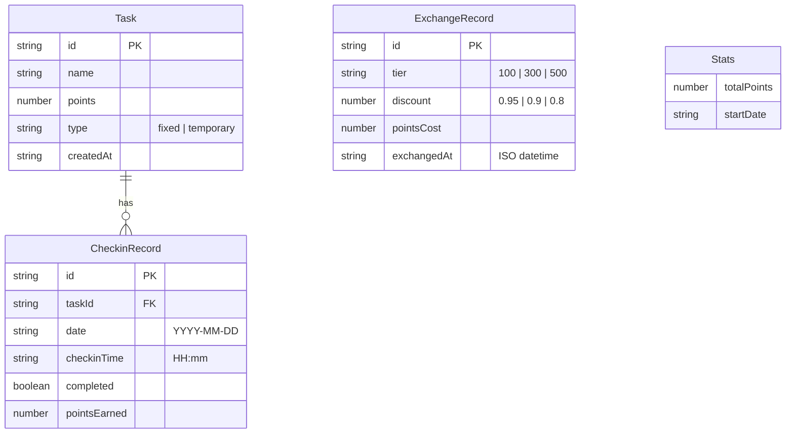

## 1. 架构设计

```mermaid
flowchart TB
    subgraph "前端层"
        "React 18 + TypeScript"
        "Tailwind CSS"
        "Zustand 状态管理"
        "React Router 路由"
    end
    subgraph "数据层"
        "LocalStorage 持久化"
        "Zustand Store 内存状态"
    end
    "前端层" --> "数据层"
```

纯前端架构，无后端服务。React负责UI渲染与交互，Zustand管理应用状态并与LocalStorage同步持久化。

## 2. 技术说明

- **前端框架**：React@18 + TypeScript
- **构建工具**：Vite
- **样式方案**：Tailwind CSS@3
- **状态管理**：Zustand（含 persist 中间件自动同步 LocalStorage）
- **路由**：react-router-dom@6
- **图标**：lucide-react
- **后端**：无
- **数据库**：LocalStorage

## 3. 路由定义

| 路由 | 用途 |
|------|------|
| / | 首页：今日任务 + 快捷打卡 + 积分概览 |
| /tasks | 任务管理：添加/编辑/删除任务 |
| /history | 历史记录：查看所有打卡记录 |
| /stats | 数据统计：日/周积分统计 |
| /exchange | 积分兑换：折扣兑换 + 兑换记录 |

## 4. 数据模型

### 4.1 数据模型定义



### 4.2 数据定义

**Task（任务）**
```typescript
interface Task {
  id: string;           // 唯一标识，如 'task_1700000000000'
  name: string;         // 任务名称
  points: number;       // 积分值（正整数）
  type: 'fixed' | 'temporary';  // 固定任务/临时任务
  createdAt: string;    // 创建日期 YYYY-MM-DD
}
```

**CheckinRecord（打卡记录）**
```typescript
interface CheckinRecord {
  id: string;           // 唯一标识
  taskId: string;       // 关联任务ID
  taskName: string;     // 任务名称（冗余存储，防止任务删除后丢失）
  taskType: string;     // 任务类型（冗余存储）
  date: string;         // 打卡日期 YYYY-MM-DD
  checkinTime: string;  // 打卡时间 HH:mm
  completed: boolean;   // 是否完成
  pointsEarned: number; // 获得积分（完成时为任务积分，未完成为0）
}
```

**ExchangeRecord（兑换记录）**
```typescript
interface ExchangeRecord {
  id: string;           // 唯一标识
  tier: number;         // 兑换档位：100/300/500
  discount: number;     // 折扣：0.95/0.9/0.8
  pointsCost: number;   // 消耗积分
  exchangedAt: string;  // 兑换时间 ISO datetime
}
```

**Store（全局状态）**
```typescript
interface AppStore {
  tasks: Task[];
  checkins: Record<string, CheckinRecord[]>;  // key为日期 YYYY-MM-DD
  exchanges: ExchangeRecord[];
  totalPoints: number;

  // 任务操作
  addTask: (task: Omit<Task, 'id' | 'createdAt'>) => void;
  updateTask: (id: string, updates: Partial<Task>) => void;
  deleteTask: (id: string) => void;

  // 打卡操作
  checkin: (taskId: string, date: string, customTime?: string) => void;
  uncheckin: (taskId: string, date: string) => void;

  // 兑换操作
  exchange: (tier: number) => void;
  clearExchanges: () => void;

  // 统计计算
  getDayPoints: (date: string) => number;
  getWeekPoints: (weekStart: string) => number[];
  getIncompletePoints: (date: string) => number;

  // 跨天刷新
  refreshDaily: () => void;
}
```

## 5. 核心业务逻辑

### 5.1 积分兑换规则

| 消耗积分 | 折扣 |
|----------|------|
| 100 | 95折 (0.95) |
| 300 | 9折 (0.9) |
| 500 | 8折 (0.8) |

- 积分不足时兑换按钮禁用，显示"积分不足"
- 兑换后积分立即扣除，不可逆
- 兑换需二次确认弹窗

### 5.2 每日刷新逻辑

- 应用启动时检测当前日期与上次访问日期
- 跨天时自动执行：临时任务清空、固定任务恢复未打卡状态
- 未打卡任务不计入积分统计

### 5.3 打卡规则

- 每个任务每日仅可打卡1次
- 打卡默认时间为当前时间，支持自定义（精确到时分）
- 打卡后积分实时累加到当日/总积分
- 支持取消打卡（撤回积分）

## 6. 项目目录结构

```
src/
├── components/          # 通用组件
│   ├── Layout.tsx       # 底部Tab布局
│   ├── TaskCard.tsx     # 任务卡片
│   ├── PointsCard.tsx   # 积分数据卡片
│   ├── BarChart.tsx     # 柱状图组件
│   ├── Modal.tsx        # 弹窗组件
│   ├── TimePicker.tsx   # 时间选择器
│   └── EmptyState.tsx   # 空状态组件
├── pages/               # 页面
│   ├── Home.tsx         # 首页
│   ├── Tasks.tsx        # 任务管理
│   ├── History.tsx      # 历史记录
│   ├── Stats.tsx        # 数据统计
│   └── Exchange.tsx     # 积分兑换
├── store.ts             # Zustand状态管理
├── types.ts             # TypeScript类型定义
├── utils.ts             # 工具函数
├── App.tsx              # 路由配置
├── main.tsx             # 入口文件
└── index.css            # 全局样式
```
